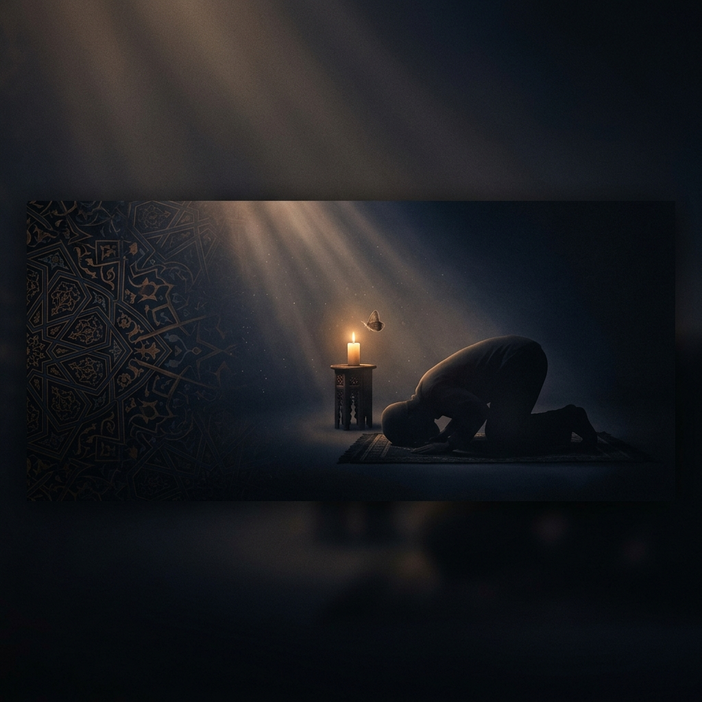
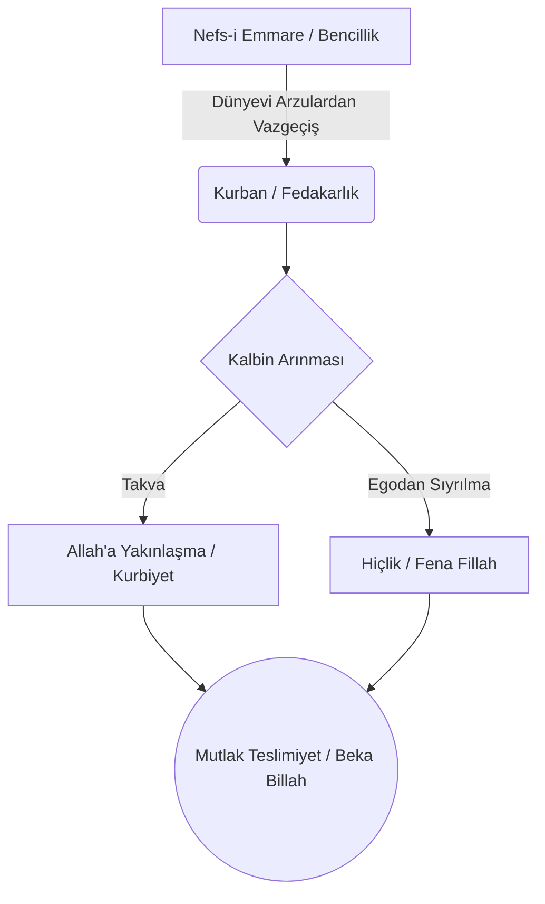
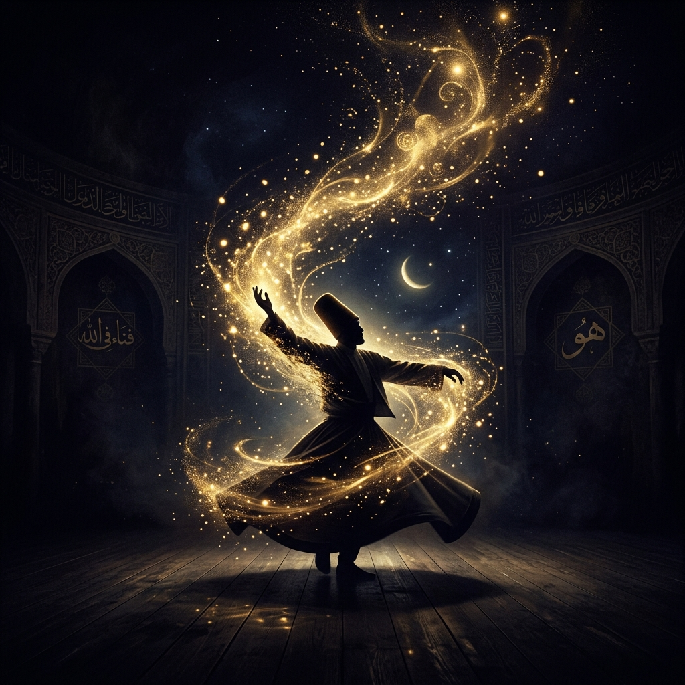

  

# 🗡️ Teslimiyet ve Hiçlik

> *"Onların ne etleri ne de kanları asla Allah'a ulaşır. Fakat O'na sadece sizden takvâ (Allah'a karşı gelmekten sakınma, sorumluluk bilinci) ulaşır..."*  
> **(Hac Suresi, 22/37)**

**Teslimiyet ve Hiçlik** (`teslimiyet-ve-hiclik`), Kurban (Udhiyye) kavramının şeklî bir ibadetin ve salt bir bayram ritüelinin ötesindeki Kur'anî, irfanî, fıkhî, edebi ve sosyolojik ağırlığını; insanın Rabb'ine karşı teslimiyetini ve nefsini feda ederek hiçliğe (fena makamına) ulaşmasını derlemeyi amaçlayan bir düşünce arşividir. 

## 🌌 Projenin Amacı ve Felsefesi

Arapça kökeni itibarıyla **"yakınlaşmak" (Kurbiyet/K-R-B)** anlamına gelen Kurban; insanın sahip olduğu veya sahip olduğunu sandığı dünyevi bağlardan, en çok sevdiği şeylerden ve kalbini Allah'tan alıkoyan masivadan (Allah dışındaki her şeyden) sıyrılarak Mutlak Yaratıcı'ya yakınlaşma çabasıdır. Kurban, var olan bir şeyi yok etmek değil; onu daha yüce bir anlam uğruna Allah'a sunmak, kendi cüz'i iradesinden vazgeçerek Külli İrade'ye tam bir teslimiyet göstermektir.

Bu depo, inancın en büyük sınavı olan "teslimiyet" makamını İslam düşünce geleneğinin, Kur'an ayetlerinin, sünnetin ve büyük mutasavvıfların merceğinden anlamlandırmaya çalışır. Amacımız; kurbanı sadece et dağıtmak bağlamına sıkıştırılmış bir eylemden çıkarıp, **"Nefsimden nasıl vazgeçebilirim?", "İçimdeki putları nasıl boğazlarım?", "Ümmet bilincini nasıl inşa ederim?" ve "Hakiki manada Allah'a nasıl teslim olurum?"** soruları etrafında okumaktır.

### 🧭 Teslimiyetin Manevi Yolculuğu

Tasavvufi ve İslami literatürde kurban eylemi ile ulaşılan makamlar aşağıdaki şemada özetlenmiştir:

---

## 🕌 Kur'an, Sünnet ve Fıkıh Çizgisinde Kurban (Udhiyye)

### 1. Kur'an'da Takva ve Kurbiyet (Hac 37 ve Saffat 102)
Kur'an-ı Kerim, kurbanın et ve kan değil, bütünüyle **takva** (sorumluluk bilinci ve kalbin temizliği) olduğunu vurgular (Hac 37). Saffat Suresi 102. ayette ise teslimiyetin şahikası anlatılır: Hz. İbrahim, Allah'ın emrine itaat ederek ciğerparesi İsmail'i kurban etmeye kalktığında; Hz. İsmail hiçbir tereddüt göstermeden *"Babacığım, emrolunduğun şeyi yap. İnşallah beni sabredenlerden bulacaksın"* diyerek mutlak itaati göstermiştir. Kurban, insanın gerektiğinde Allah için en sevdiğinden geçebileceğinin sembolik ilanıdır.

### 2. Hz. Hacer'in Teslimiyeti ve Sa'y İbadeti
Teslimiyet sadece bıçağın altına yatanın değil, evladını çölün ortasında Allah'a emanet edenin de imtihanıdır. Hz. Hacer, Hz. İbrahim kendilerini Mekke'nin ıssız çölünde bıraktığında *"Bunu sana Allah mı emretti?"* diye sormuş, "Evet" cevabını alınca *"Öyleyse O bizi zayi etmez"* diyerek muazzam bir tevekkül göstermiştir. Safa ve Merve tepeleri arasındaki çırpınışı (Sa'y), insanın ilahi takdire teslim olurken aynı zamanda var gücüyle çabalamasının (gayretin) en güzel örneğidir.

### 3. Sünnette Kurban Uygulaması ve Veda Haccı
Peygamber Efendimiz (s.a.v.), kurban ibadetinin meşru kılındığı hicretin ikinci yılından vefatına kadar her yıl kurban (Udhiyye) kesmiştir. Sünnette kurban ibadeti büyük bir titizlikle yerine getirilmiştir. Örneğin Veda Haccı'nda Allah Resulü (s.a.v.), ümmetine bir örnek olarak bizzat yüz deve kurban etmiş ve bu etlerin yoksullara dağıtılmasını emretmiştir. O'nun kurban anlayışında merhamet, hayvanlara eziyet etmemek, besmele ve tekbir ile tam bir ihlasla ibadeti gerçekleştirmek esastır. 

### 4. Fıkhî Açıdan Udhiyye ve Kurbanın Sırları
İslam fıkhında Udhiyye, yalnızca et ihtiyacını gidermek için kesilen bir hayvan değil; şükrün, kulluğun ve Allah'ın rızasını aramanın somut bir göstergesidir. Kurban yerine sadaka vermenin kurban ibadetinin yerini tutmamasının fıkhî sırrı, kurban ritüelinin içinde "kan akıtarak can fedakarlığını ve ilahi teslimiyeti" fiziken deneyimleme zorunluluğunun yatmasıdır.

---

## ⚖️ Kurban Bayramı'nın Sosyolojisi ve Ümmet Bilinci

Kurban Bayramı, İslam sosyolojisi açısından bireysel bir ibadetin ötesinde devasa bir **sosyal adalet** ve **ümmet dayanışması** projesidir.

| Sosyolojik Boyut | Kurbanın Etkisi |
| :--- | :--- |
| **Ekonomik Denge** | Yoksulların et ihtiyacının karşılanması, kapitalist yığma kültürüne karşı İslami paylaşımın tesisi. |
| **Sosyal Dışlanma** | Toplumun alt gelir gruplarının bayram coşkusuna dahil edilmesiyle sosyal kopukluğun önlenmesi. |
| **Küresel Kardeşlik** | Dünyanın dört bir yanındaki dindaşlara ulaşarak sınırlar ötesi "Ümmet" şuurunun güçlenmesi. |

---

  

## 🕯️ İslam Düşüncesinde ve İrfan Geleneğinde Teslimiyet

### 1. Rıza Makamı ve Kaza-Kadere Teslimiyet
Tasavvufun en yüce mertebelerinden biri olan **Rıza makamı**, kulun başa gelen iyi veya kötü her şeyi Allah'ın bir takdiri (Kader) ve icrası (Kaza) olarak görüp sükûnet bulmasıdır. İsyanın, "Neden ben?" sorusunun bittiği yerdir. Gerçek teslimiyet, nimet anındaki şükrün ötesinde, acı ve imtihan anında da (tıpkı kurban olan İsmail gibi) Allah'ın hükmüne razı olabilmektir. Rıza, nefsin en büyük kurban ediliş biçimidir.

### 2. Tasavvufta Çile, Seyr-i Sülûk ve Kurbanın Metafizik Evreleri
Tasavvufta manevi olgunlaşma süreci olan Seyr-i Sülûk, baştan sona bir kurban etme pratiğidir. Bu yolculuk Şeriat (kurallara teslimiyet), Tarikat (nefsin arzularından geçme), Hakikat (varlık zannından sıyrılma) ve nihayetinde Marifet (sadece O'nu bilme) evrelerinden oluşur. Çilehanelerde 40 gün boyunca dünyadan el etek çekmek (Erbain/Halvet), insanın kendi içindeki hayvani dürtüleri manen boğazlayıp ruhani varlığını diriltmesi anlamına gelir.

### 3. İmam Gazzali: İhyâ'da Kurbanın Sırları
İslam hücceti İmam Gazzali'ye göre kurban, kulun Allah’a olan bağlılığını ve dünyevi varlıklardan vazgeçebileceğini fiilen ispatlamasıdır. Kurban, kişinin içindeki cimriliği, dünya sevgisini ve nefsani arzuları boğazlaması anlamına gelir. İbadetin zahirini (dış kurallarını) yerine getirmek farz iken, asıl maksat olan batınına (içsel sırrına) erişmek, ancak kişinin hayvanla birlikte kendi kibir ve egosunu da kurban etmesiyle mümkündür.

### 4. İbn Arabî ve Vahdet-i Vücud'da "Hiçlik" (Fena Fillah)
Şeyhül Ekber Muhyiddin İbn Arabî'nin varlık anlayışında Mutlak Varlık yalnızca Allah'tır. Kurban, insanın kendi sınırlı benliğini (egosunu) ve "ben varım" zannını Hakk'ın mutlak varlığında eritmesi sürecidir. "Hiçlik", bir yok oluş veya değersizlik değil; aksine gerçek varlığa (Allah'a) yer açmak için sahte benliğin aradan çekilmesidir. Kendi sahte benliğini hiçleştiren (fena makamına ulaşan) sâlik, her şeyin O'ndan gelip O'na döndüğünü müşahede eder.

### 5. Hallac-ı Mansur ve Hak Yolu'nda Canı Feda Etmek
Tasavvufta teslimiyetin en çarpıcı örneği Hallac-ı Mansur'dur. *Enel Hak* (Ben Hakk'ım) nidası, bir ilahlık iddiası değil; "Ben yokum, sadece O (Hak) var" diyen vahdet sarhoşluğunun ve mutlak hiçliğin ifadesidir. Hallac, bedenini ve canını ilahi aşk uğruna kurban ederek, nefsi feda etmenin tasavvuf tarihindeki en trajik ve sembolik örneğini miras bırakmıştır.

---

## 📜 Divan Edebiyatında Teslimiyetin Estetiği

Edebiyatımızda kurban olma, canı feda etme ve hiçlik temaları, son derece ince metaforlarla işlenmiştir:

*   **Şem ve Pervane (Mum ve Kelebek):** Divan şiirinin en güçlü tasavvufi sembollerinden biridir. *Şem* (mum), ilahi nuru ve hakikati (Allah'ı) temsil ederken; *Pervane*, o nura âşık olan dervişi simgeler. Pervane, ışığa olan aşkından ötürü ateşin etrafında döner ve sonunda kendini alevin içine atarak yanıp kül olur. Bu; bedeni aşk uğruna kurban etmenin ve Fenâ Fillah (Allah'ta yok olma) makamına erişmenin en estetik ifadesidir. Pervane ateşte "hiç" olurken, aslında ebediyete kavuşmuştur.
*   **Aşk-ı Mecazi'den Aşk-ı Hakiki'ye Geçiş:** Divan şairleri genellikle dünyevi bir güzeli över gibi görünseler de, asıl kastettikleri ilahi güzelliktir (Hüsn-i Mutlak). Mecazi aşktaki acı çekme, reddedilme ve sevgilinin uğruna can feda etme isteği, kulu Allah aşkına hazırlayan bir antrenman gibidir. Leyla'yı seven Mecnun'un en sonunda Leyla'dan geçip Mevla'yı bulması, sahte putların kurban edilerek gerçek aşka ulaşılmasını simgeler.

---

  

## 🪞 Modern Çağın İsmailleri: "Tükenmişlik" ve Putlar

### 1. Ali Şeriati: "Senin İsmail'in Kim?"
Ali Şeriati, *Hacc* kitabında kurbanı sosyolojik ve ahlaki bir varoluş krizine uyarlar. Hacıya şu can alıcı soruyu sorar: *"Senin İsmail'in kim?"* İsmail; kişinin makamı, şöhreti, parası, güzelliği veya gençliğidir. Yani Allah'a giden yolda insanı alıkoyan, "en değerli" gördüğü her ne varsa onun "İsmail"idir. Haccın ruhu, o İsmail'i Mina'da kurban edebilmektir. Aksi halde yapılan iş sadece kasaplıktır.

### 2. Modern Putlara Karşı Tevhid
Modern insan, Allah'a teslim olmaktan kaçarken, kendi hırslarının kölesi olmuştur. Kapitalist düzenin "başarı", "performans" ve "statü" sunaklarında insanlar kendi ruhlarını, zamanlarını ve ailelerini kurban etmektedir (oto-sömürü). İslam'ın tevhid inancı (La ilahe illallah), insanı bu sahte putlara kul olmaktan kurtarıp, "kurban" ve "teslimiyet" kavramlarını ait oldukları tek gerçek merkeze, Allah'a yönelterek insanı özgürleştirir.

---

## 📖 Hakikat Aynasından Alıntılar

Aşağıdaki alıntılar, bu deponun ruhunu ve felsefesini şekillendiren temel taşlarıdır:

> *"Çocuk kendisiyle birlikte koşup yürüyecek çağa gelince İbrahim ona, 'Yavrum, ben rüyamda seni boğazladığımı gördüm. Düşün bakalım, ne dersin?' dedi. O da, 'Babacığım, emrolunduğun şeyi yap. İnşallah beni sabredenlerden bulacaksın' dedi."*  
> **- Kur'an-ı Kerim, Saffat Suresi, 37/102**

> *"Onların ne etleri ne de kanları asla Allah'a ulaşır. Fakat O'na sadece sizden takvâ ulaşır."*  
> **- Kur'an-ı Kerim, Hac Suresi, 22/37**

> *"İmanın dört temeli vardır: Allah’a tevekkül etmek, işleri O’na bırakmak, emirleri karşısında teslim olmak, kaza ve kaderine razı olmak."*  
> **- Hz. Ali (r.a.)**

> *"Her musibetin bir zamanı vardır, o zaman mutlak yaşanmalıdır. Başına geldiğinde, zamanı geçene kadar teslim olup sabret. Zira musibeti gidermek için çırpınmak, onun zorluğunu çoğaltır."*  
> **- Hz. Ali (r.a.)**

> *"Kurban, kulun cimriliğini ve dünya sevgisini boğazlamasıdır. Bedenin değil, kalbin haccıdır."*  
> **- İmam Gazzali (İhyâu Ulûmi’d-Dîn)**

> *"Bu dünyada herkes bir şey olmaya çalışırken, sen HİÇ ol. Menzilin yokluk olsun. Nasıl ki çömleği tutan dışındaki biçim değil, içindeki boşluk ise, insanı ayakta tutan da benlik zannı değil, hiçlik bilincidir."*  
> **- Şems-i Tebrizi**

> *"Hakk'a teslimiyet ne zayıflık ne edilgenlik demektir. Tam tersine, böylesi bir teslimiyet son derece güçlü olmayı gerektirir. Teslim olan insan çalkantılı ve girdaplı sularda debelenmeyi bırakır, emin bir beldede yaşar."*  
> **- Şems-i Tebrizi**

> *"Kendi varlığından (benliğinden) sıyrılan kimse, Hakk'ın varlığıyla beka bulur."*  
> **- Muhyiddin İbn Arabî**

> *"Senin İsmail'in kimdir? Kendin bileceksin. Başkası bilemez. Belki eşin, işin, yeteneğin, gücün, statündür... Senin zayıf noktan neyse, seni yolda alıkoyan neyse, İsmail'in odur. Onu kurban etmelisin ki zincirlerinden kurtulasın."*  
> **- Ali Şeriati (Hacc)**

> *"İsmail gibi boynunu uzat ki, bıçak kesmesin. Bıçak, teslim olanı değil, direneni keser."*  
> **- Mevlânâ Celâleddîn-i Rûmî**

> *"Ben Hak'kım! (Enel Hak) ... Eğer Onu tanımıyorsanız, bari eserlerini tanıyın. İşte o eser benim!"*  
> **- Hallac-ı Mansur**

> *"Cânı cânân dilemiş vermemek olmaz ey dil / Ne nizâ eyleyelim ol ne senindir ne benim"*  
> **- Fuzûlî**

> *"Her şey, her şey şu tek müjdede; / Yoktur ölüm, Allah diyene! / Canım kurban, başı secdede, / İki büklüm, Allah diyene!"*  
> **- Necip Fazıl Kısakürek**

> *"Mal sahibi, mülk sahibi / Hani bunun ilk sahibi? / Mal da yalan, mülk da yalan / Var biraz da sen oyalan."*  
> **- Yunus Emre**

*(Daha fazla alıntı için [alintilar.md](alintilar.md) dosyasına göz atabilirsiniz.)*

---

## 📂 Depo İçeriği ve Dizin Yapısı

Bu arşiv, kurban ve teslimiyet kavramlarının derinliklerini inceleyebilmek için aşağıdaki hiyerarşide düzenlenmiştir:

*   📖 **`kuran_ve_sunnet/`**: Kur'an ayetleri tefsirleri, Hz. Hacer'in teslimiyeti, Hadis-i Şerifler, Veda Haccı uygulamaları ve fıkhî kavramlar.
*   📜 **`tasavvuf_ve_irfan/`**: İmam Gazzali, İbn Arabi, Hallac-ı Mansur ve mutasavvıfların hiçlik, fena fillah, rıza makamı üzerine yazıları.
*   🖋️ **`edebi_yansimalar/`**: Şem ve Pervane metaforları, ilahi aşk uğruna canı feda etme temaları. Sadece metin değil, **Hüsn-i Hat (Kaligrafi) ve görsel sanat** eserlerine de açıktır.
*   🪞 **`ismailini_bulmak/`**: Ali Şeriati okumaları, sosyolojik değerlendirmeler, ümmet bilinci, modern çağın putları ve insanın kendini dünyaya kurban etmesi üzerine eleştiriler.
*   💬 **`alintilar.md`**: İslam alimlerinden, mutasavvıflardan ve düşünürlerden kurban, hiçlik ve teslimiyet üzerine vurucu aforizmaların derlendiği ana kaynak.

---

## 🤝 Katkıda Bulunma

Bu depo, tefekkür eden, okuyan ve teslimiyetin sırrını arayan herkese açıktır. Eğer Kurban, takva, hiçlik (fena), adanmışlık, sosyolojik ümmet bilinci veya nefsi feda etmek üzerine İslami, tasavvufi bir metin, makale çevirisi veya ayet/hadis/alıntı biliyorsanız;

1. Bu repoyu "Fork"layın.
2. İlgili klasöre metninizi veya `.md` dosyanızı (hatta konuyla ilgili görsel tasarımlarınızı) ekleyin.
3. Bir "Pull Request" (PR) oluşturun.

*Hiçlikte ve sükûnette, O'nun rızasında buluşmak dileğiyle.*
